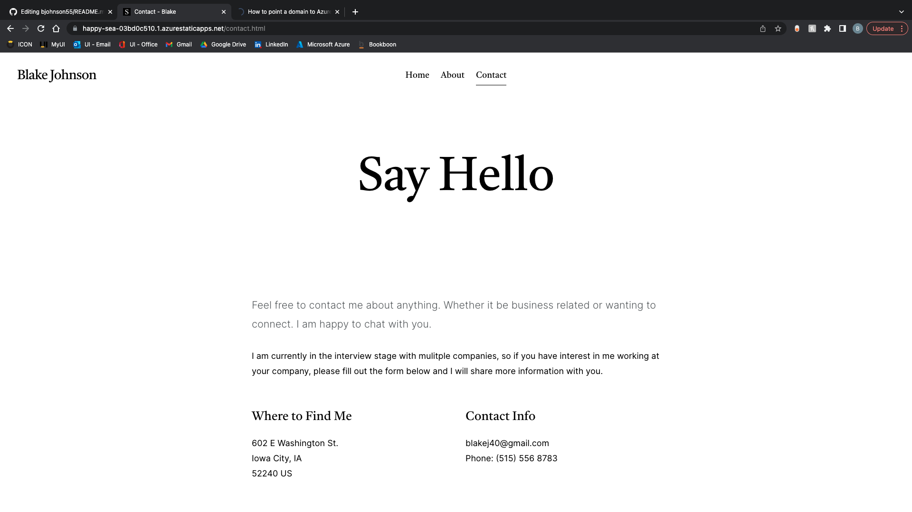

# My Website
> This project revolves around creating my own web presence online. Utilizing a template I have created my own portfolio site that is all about me, my interests, and my contact info.
> Visit site [_here_](https://happy-sea-03bd0c510.1.azurestaticapps.net).

## Table of Contents
* [General Info](#general-information)
* [Technologies Used](#technologies-used)
* [Features](#features)
* [Screenshots](#screenshots)
* [Project Status](#project-status)
* [Acknowledgements](#acknowledgements)
* [Contact](#contact)

## General Information
- Personal website with my own custom domain
- Established my online web presence
- Helped me learn to write my own HTML
- Application of CSS formatting

## Technologies Used
- Visual Studio Code - version 1.60.2
- Microsoft Azure - Static Web application
- NameCheap - Domain Name Registrar
- Google Analytics

## Features
- Photos
- Navigation Pane
- Contact Feature

## Screenshots

## Project Status
Throughout my career, I will update this page periodically as I progess in my accomplishments.

## Acknowledgements
- This project was inspired by Prof. Mike Colbert (Professor of Business Analytics and Information Systems, Tippie College of Business, The University of Iowa)

## Contact
Created by [@bjohnson55](https://happy-sea-03bd0c510.1.azurestaticapps.net) - feel free to contact me!

